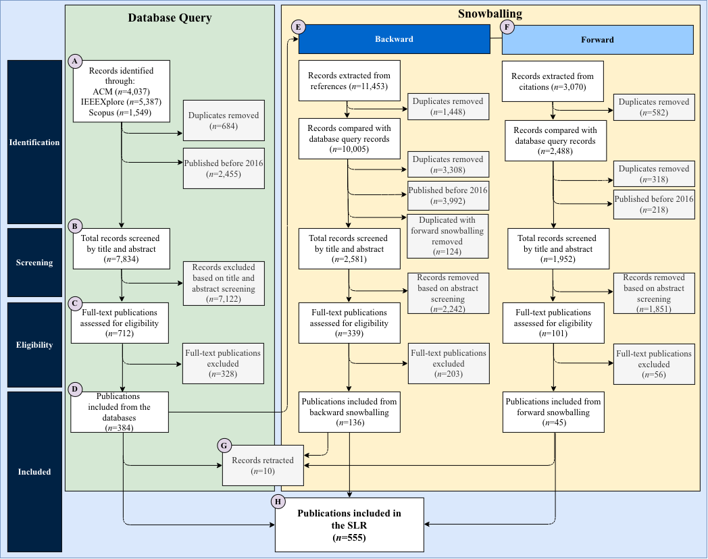

# Phase 1 & 2 — Screening and Snowballing Data-Extraction Tables

This folder holds the reviewer decision tables produced at each stage of the SLR, alongside the tables from the backward/forward snowballing passes. The diagram below (a PRISMA-style flow diagram) shows how these stages connect, and each table below is labeled with the diagram box(es) it corresponds to.

## SLR flow diagram

The diagram has two parallel tracks that both feed into the final included set (**H**, n=555):

- **Database Query** (left, green) — records identified via ACM, IEEE Xplore, and Scopus, then deduplicated, screened by title/abstract (**B**), and assessed full-text (**C**), producing the publications included from the databases (**D**, n=384).
- **Snowballing** (right, yellow) — records pulled from the reference lists (**Backward**, **E**) and citing works (**Forward**, **F**) of already-included papers, each going through its own duplicate-removal, title/abstract screening, and full-text eligibility pass.

All four tracks are then combined, minus retractions (**G**, n=10), into the final included set (**H**).

## Tables in this folder

| File | Diagram stage | What it contains |
|---|---|---|
| `phase1-paper-evaluation-title-abstract.xlsx` | **B** — Total records screened by title and abstract (database query) | The full master screening/tracking workbook (all tabs: `ITiCSE2026-WG10-New`, `Responses`, `Manual Answers`, `Consolidated`, `IN`, `OUT`, `Discussion`, `Judging`, `Status`, `FindDOIProgress`, `FetchProgress`), exported directly from Google Sheets. See [`../../screening-tool-documentation.md`](../../screening-tool-documentation.md) for what each tab means and how they relate. |
| `phase2-paper-evaluation-full-paper.xlsx` | **C** — Full-text publications assessed for eligibility (database query) | Reviewer decisions from full-text eligibility assessment of the database-query track, following the inclusion/exclusion criteria in [`../../../docs/methodology/ai-assisted-extraction.md`](../../../docs/methodology/ai-assisted-extraction.md). |
| `forward-snowballing.xlsx` | **F** — Forward snowballing (records extracted from citations, screened, and assessed for eligibility) | Screening and eligibility decisions for papers found by checking what cites the already-included papers. |
| `backward-snowballing.xlsx` | **E** — Backward snowballing (records extracted from references, screened, and assessed for eligibility) | Screening and eligibility decisions for papers found in the reference lists of already-included papers. |

### Notes

`phase1-paper-evaluation-title-abstract.xlsx` contains the entire master tracking workbook, not just the title/abstract tab. Google Drive's export API rejected this file as too large, but a manual export from Google Sheets (File → Download → Microsoft Excel) succeeded and preserved all tabs — which is arguably more useful here, since the `ITiCSE2026-WG10-New` tab (the raw title/abstract screening) is easiest to interpret alongside `Responses`, `Consolidated`, `IN`/`OUT`/`Discussion`, and `Judging`, all in one file.

For the Phase 2 field definitions and both AI-assisted extraction iterations, see [`../../../docs/methodology/ai-assisted-extraction.md`](../../../docs/methodology/ai-assisted-extraction.md). For how the screening tool and its pipeline work, see [`../../screening-tool-documentation.md`](../../screening-tool-documentation.md).
